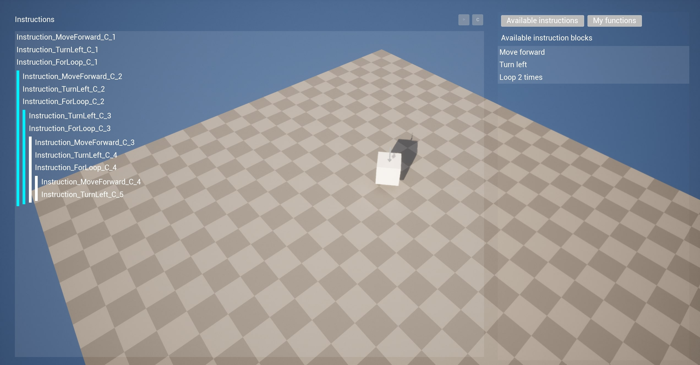
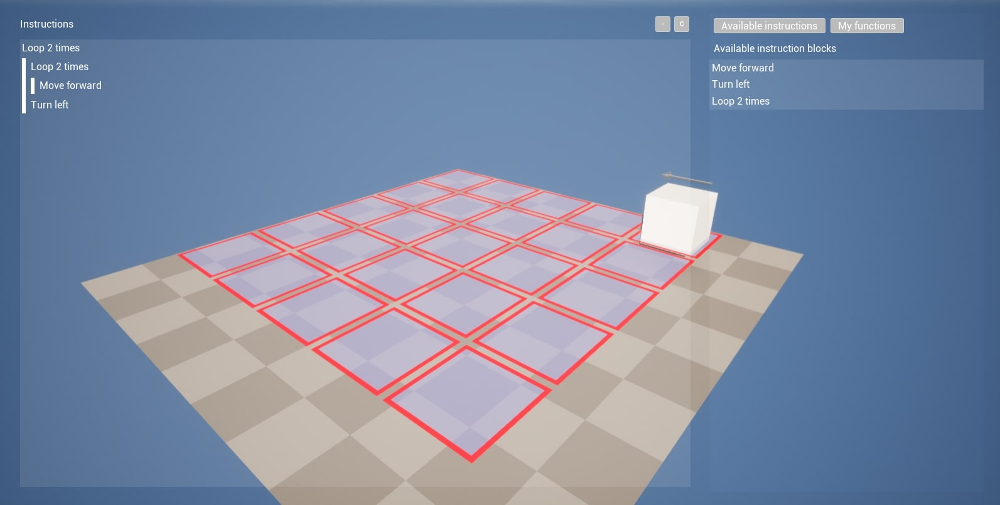
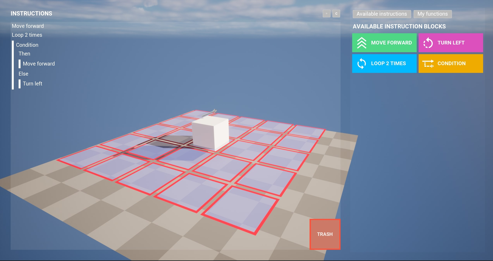
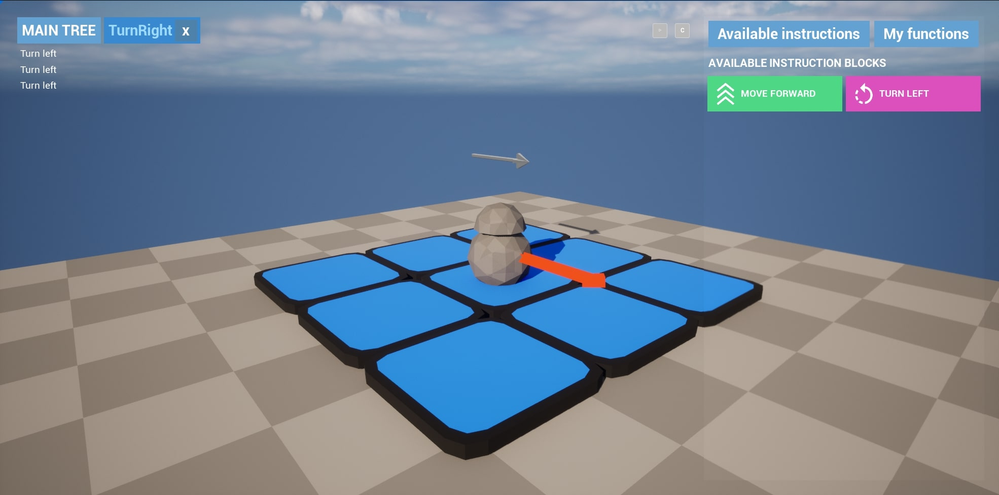

# Bachelor thesis

Made by Petr Vavřínek in 2023

## Features
- Dynamic character control based on instructions
- Recursive depthless instruction tree
- Simple grid and it's visualisation
- Custom instruction functions

Screenshot (15.01.2023)

Screenshot (17.01.2023)

Screenshot (17.01.2023)

Screenshot (28.02.2023)

## TOTO Features
- Levels
- Translations
- Better models, textures, etc...
- Visualize grid
- Add instruction "play", "stop", "pause" buttons

Developed with Unreal Engine 5
