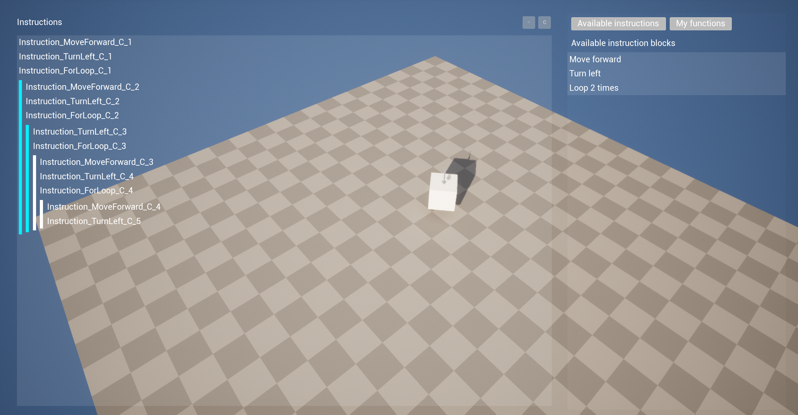

# Bachelor thesis

Made by Petr Vavřínek in 2023

## Features
- Dynamic character control based on instructions
- Recursive depthless instruction tree

Screenshot (15.01.2023)

## TOTO Features
- Own functions
- Levels
- Translations
- Better models, textures, etc...
- Visualize grid
- Add instruction "play", "stop", "pause" buttons

## Known issues
- If any widget with droppable inside is moved to another droppable area, all children dissapear, after add one, everything shows again

Developed with Unreal Engine 5
